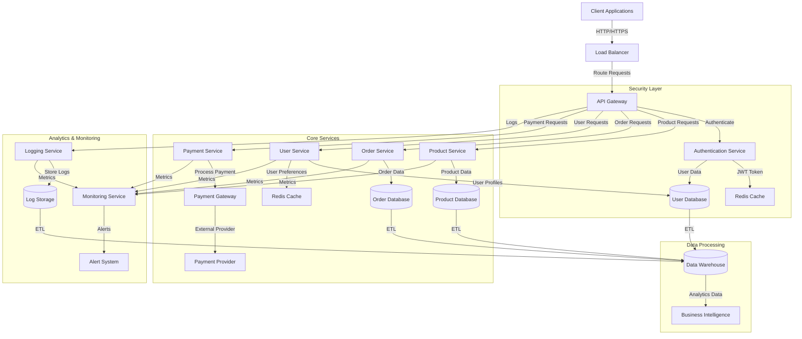
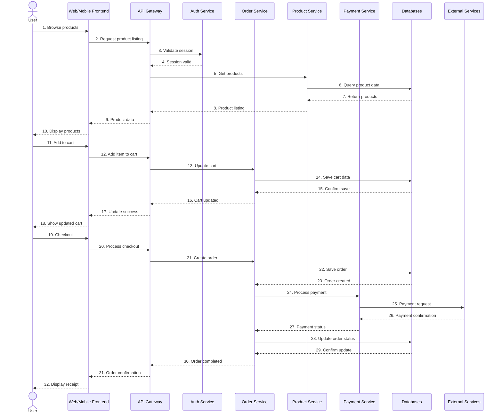
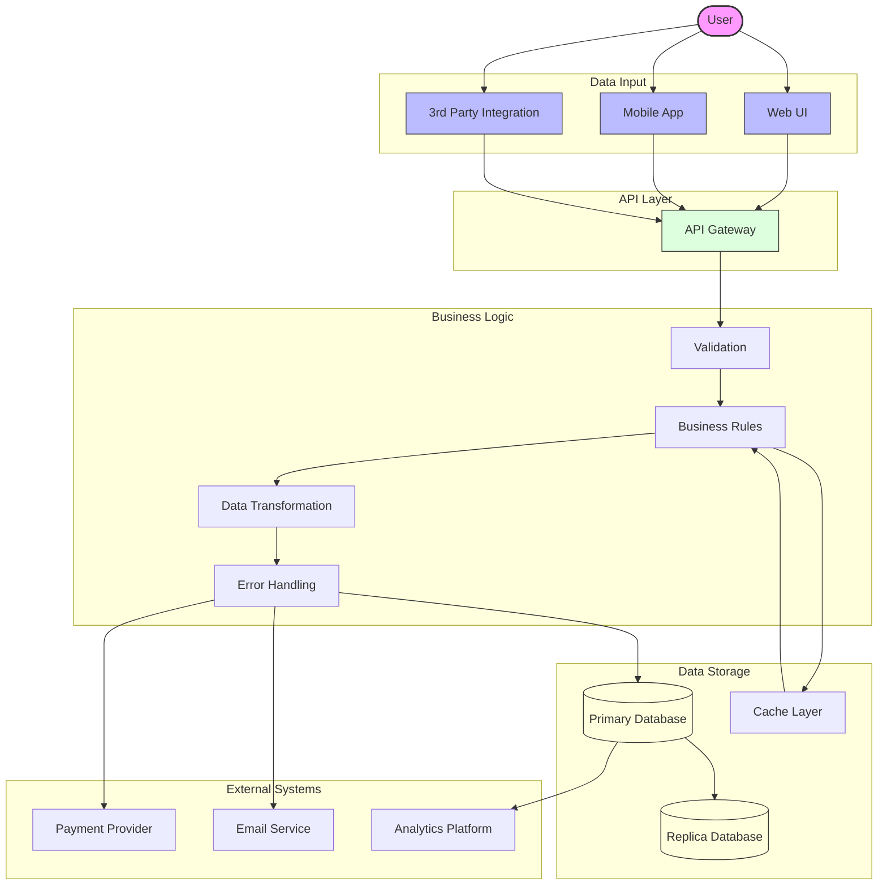
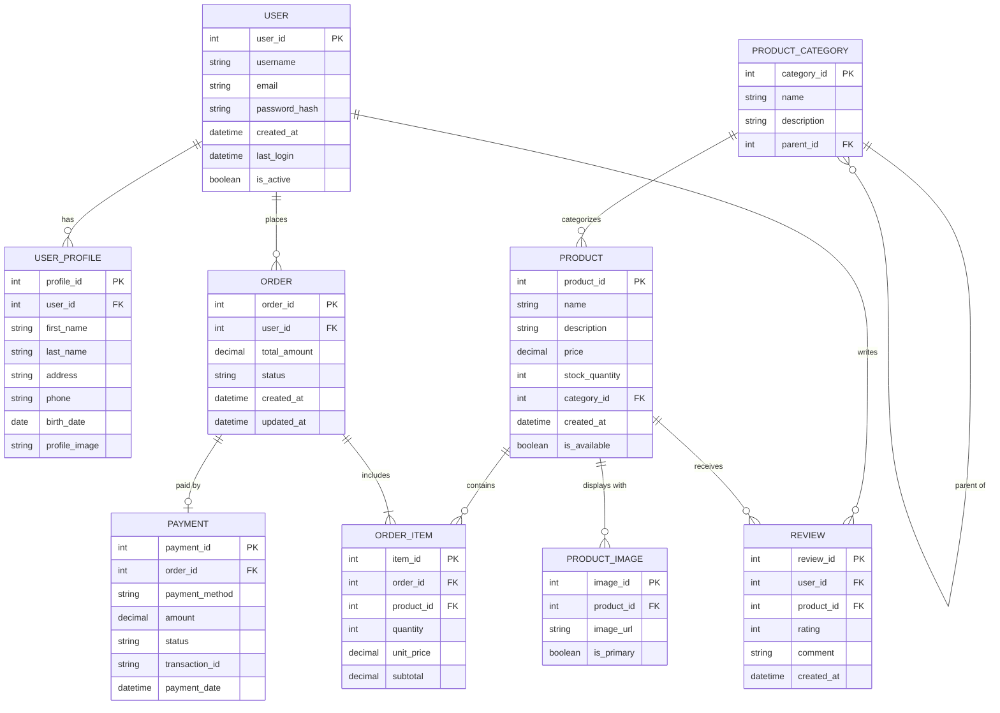
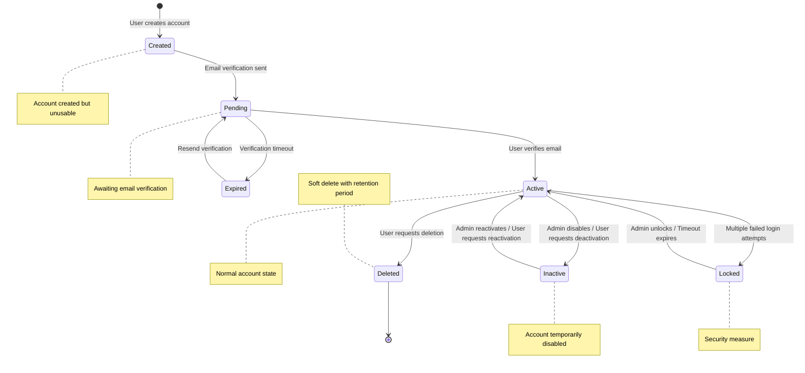
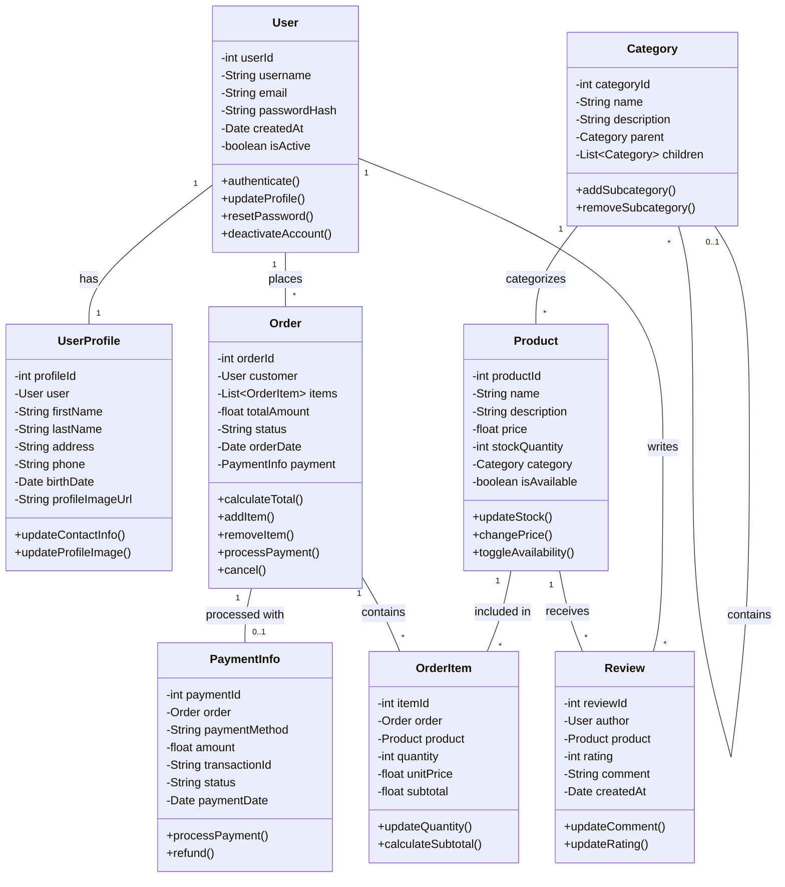
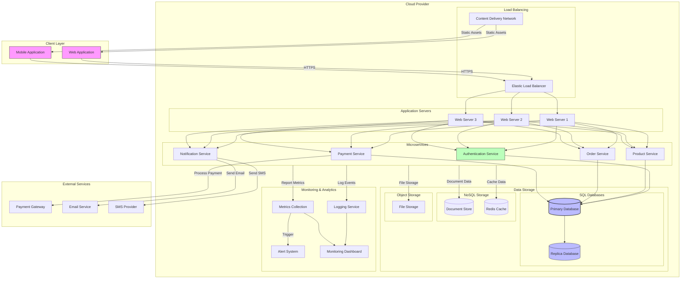

# Architecture

## System Overview
High-level description of the system architecture.

## Components
### Component 1
Description of component 1 and its responsibilities.

### Component 2
Description of component 2 and its responsibilities.

## Data Flow
Description of how data flows through the system.

## Technology Stack
- Frontend: [Technologies]
- Backend: [Technologies]
- Database: [Technologies]
- Infrastructure: [Technologies]

## Design Decisions
Explanation of key architectural decisions and their rationales.

## Diagrams

### System Architecture Diagram

### Component Interaction Diagram

### Data Flow Diagram

### Entity Relationship Diagram

### State Diagram

### Class Diagram

### Deployment Diagram

